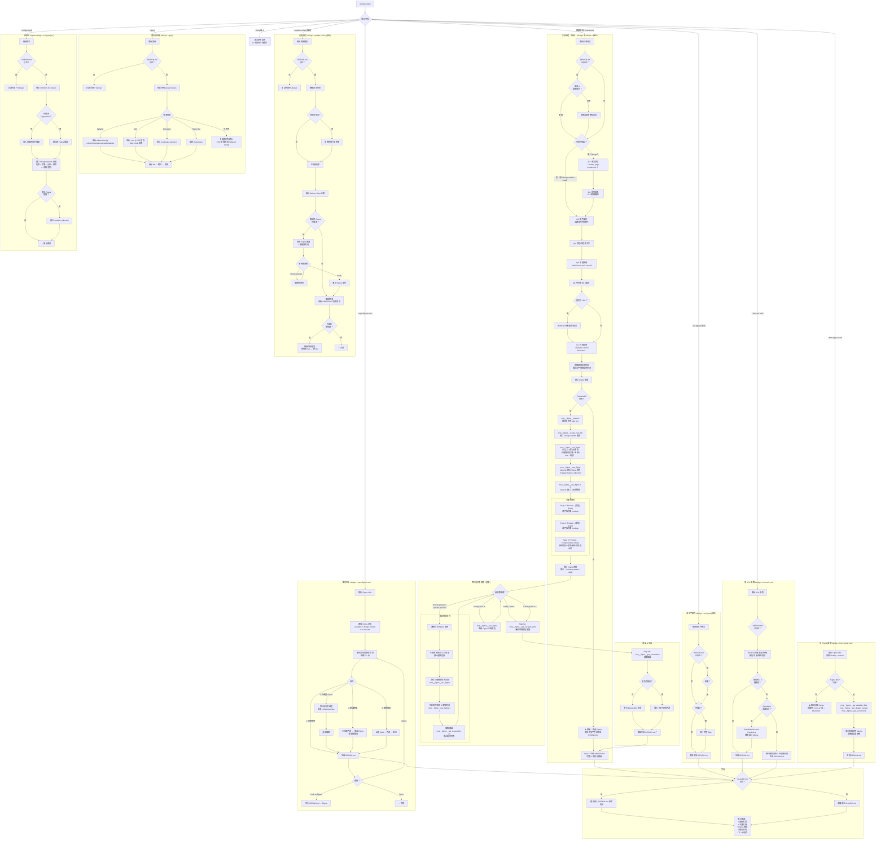
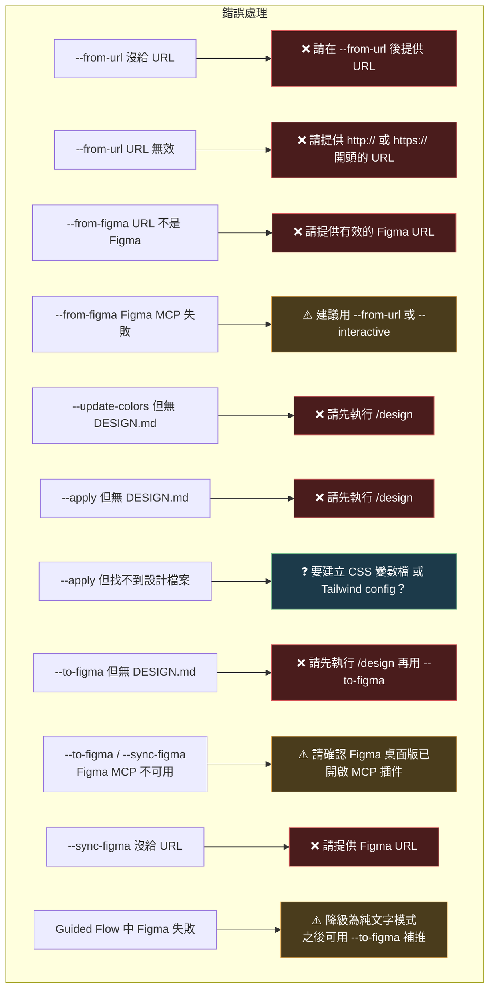

# /design — DESIGN.md Skill for Claude Code

A Claude Code custom skill that generates, manages, and syncs design system files (`DESIGN.md`) with Figma integration. Decide all your colors, typography, spacing, and component styles **before** building any application — and update them after.

一個 Claude Code 自訂技能，用於生成、管理及同步設計系統檔案（`DESIGN.md`），支援 Figma 雙向整合。在開發任何應用程式**之前**就決定好所有顏色、字型、間距和元件樣式，開發後也能隨時更新。

---

## How It Works / 運作方式

The default flow is **Figma-first** and interactive:

預設流程以 **Figma 為核心**，互動式引導：

```
/design
  1. Claude asks about your project preferences (Q&A)
     Claude 詢問你的專案偏好（問答）

  2. Generates a proposed color palette
     生成建議的調色盤

  3. Creates a Figma file with color swatches via Figma MCP
     透過 Figma MCP 建立含有色票的 Figma 檔案

  4. You adjust colors visually in Figma
     你在 Figma 中視覺化調整顏色

  5. Claude reads back your final choices
     Claude 讀取你的最終選擇

  6. Generates complete DESIGN.md (9 sections)
     生成完整的 DESIGN.md（9 個章節）
```

## Demo / 示範

```bash
# Start guided flow with Figma / 啟動 Figma 引導流程
/design

# Skip Q&A, provide description / 跳過問答，直接描述
/design modern minimalist SaaS with indigo accents

# Text-only, no Figma / 純文字模式，不使用 Figma
/design --no-figma clean dashboard with blue tones

# Extract from a website / 從網站擷取設計
/design --from-url https://linear.app

# Extract from Figma file / 從 Figma 檔案擷取
/design --from-figma https://figma.com/design/abc123/MyDesign

# Update colors later / 之後更新顏色
/design --update-colors "warmer tones, switch to green"

# Apply tokens to project files / 套用設計到專案檔案
/design --apply --framework tailwind

# Push DESIGN.md to Figma / 將 DESIGN.md 推送到 Figma
/design --to-figma

# Bidirectional Figma sync / Figma 雙向同步
/design --sync-figma https://figma.com/design/abc123/MyApp

# Interactive layout assembly / 互動式版面組裝
/design --layout landing-page

# Video scene picker with Figma storyboard / 影片場景拼裝 + Figma 分鏡預覽
/design --video-layout

# Apply design tokens to Remotion project / 套用設計到 Remotion 影片專案
/design --apply --framework remotion --target ./
```

## Installation / 安裝

Copy `design.md` to your Claude Code commands directory:

將 `design.md` 複製到你的 Claude Code 指令目錄：

```bash
# macOS / Linux
cp design.md ~/.claude/commands/design.md

# Windows
copy design.md %USERPROFILE%\.claude\commands\design.md
```

That's it. The `/design` command is now available globally in all your projects.

就這樣。`/design` 指令現在在你所有的專案中都可以使用了。

## Requirements / 需求

### Required / 必要

- **Claude Code** — [claude.ai/code](https://claude.ai/code)

### Optional (for Figma integration) / 選用（Figma 整合）

The skill works without Figma (`--no-figma` mode), but the full interactive flow requires:

此技能可以在沒有 Figma 的情況下運作（`--no-figma` 模式），但完整的互動流程需要：

> ⚠️ **Figma Paid Plan Required** — The Figma Dev Mode MCP Server is **NOT** available on the free Starter plan.
> You need a **Professional**, **Organization**, or **Enterprise** seat (Dev or Full) to enable the MCP server.
> See [Figma's plan comparison](https://www.figma.com/pricing/) for details.
>
> ⚠️ **需要 Figma 付費方案** — Figma Dev Mode MCP Server **不支援**免費的 Starter 方案。
> 你需要 **Professional**、**Organization** 或 **Enterprise** 的 Dev 或 Full seat 才能啟用 MCP server。
> 詳見 [Figma 方案比較](https://www.figma.com/pricing/)。
>
> 💡 If you don't have a paid Figma plan, use `/design --no-figma` for text-only DESIGN.md generation, or `/design --from-url <url>` to extract design tokens from any website.
>
> 💡 沒有付費方案？可使用 `/design --no-figma` 純文字產生 DESIGN.md，或 `/design --from-url <url>` 從任何網站擷取設計 tokens。

| Tool / 工具 | Purpose / 用途 | Setup / 設定 |
|---|---|---|
| **Figma Desktop App** | Required for local Figma MCP / 本地 Figma MCP 必需 | [Download Figma](https://www.figma.com/downloads/) |
| **Figma MCP Plugin** | Connects Claude Code to Figma Desktop / 連接 Claude Code 和 Figma | Install from Figma Community: search "MCP" in Figma plugins |
| **Figma Remote MCP** (alternative) | Cloud-based Figma access / 雲端 Figma 存取 | Configure in `~/.claude/settings.json` — endpoint: `https://mcp.figma.com/mcp` |

#### Figma MCP Setup / Figma MCP 設定

**Option A: Figma Desktop (recommended) / 選項 A：Figma 桌面版（建議）**

1. Install [Figma Desktop](https://www.figma.com/downloads/)
2. In Figma, go to **Plugins** > search for **"Claude Code"** or **"MCP"** > Install
3. Run the plugin in Figma — it starts a local MCP server
4. Add to your `~/.claude/settings.json`:

```json
{
  "mcpServers": {
    "figma": {
      "type": "sse",
      "url": "http://127.0.0.1:3845/sse"
    }
  }
}
```

**Option B: Figma Remote MCP / 選項 B：Figma 遠端 MCP**

Add to your `~/.claude/settings.json`:

在 `~/.claude/settings.json` 中加入：

```json
{
  "mcpServers": {
    "figma": {
      "type": "sse",
      "url": "https://mcp.figma.com/mcp"
    }
  }
}
```

Then authenticate when prompted by Claude Code.

然後在 Claude Code 提示時進行認證。

### Optional (for website extraction) / 選用（網站擷取）

For `--from-url` mode with JavaScript-heavy sites:

用於 `--from-url` 模式處理大量 JavaScript 的網站：

| Tool / 工具 | Purpose / 用途 | Setup / 設定 |
|---|---|---|
| **Cloudflare Browser Rendering** | Crawl JS-rendered sites / 爬取 JS 渲染的網站 | Create `~/.cloudflare/.env` with `CLOUDFLARE_ACCOUNT_ID` and `CLOUDFLARE_API_TOKEN` |

## Figma MCP Tools Used / 使用的 Figma MCP 工具

This skill uses the following Figma MCP tools:

此技能使用以下 Figma MCP 工具：

| Tool | Usage / 用途 |
|---|---|
| `mcp__figma__whoami` | Get user info and plan key / 取得用戶資訊和方案金鑰 |
| `mcp__figma__create_new_file` | Create new Figma design file / 建立新的 Figma 設計檔案 |
| `mcp__figma__use_figma` | Execute Plugin API JS to create color swatches, variables / 執行 Plugin API JS 建立色票和變數 |
| `mcp__figma__get_variable_defs` | Read design token variables (colors, spacing) / 讀取設計代幣變數（顏色、間距） |
| `mcp__figma__get_design_context` | Get code references, screenshot, metadata / 取得程式碼參考、截圖、元資料 |
| `mcp__figma__get_screenshot` | Get visual screenshot of design / 取得設計的視覺截圖 |
| `mcp__figma__search_design_system` | Search existing design system components / 搜尋現有設計系統元件 |

## All Modes / 所有模式

| Mode / 模式 | Description / 說明 |
|---|---|
| `/design` | **Default**: Guided Q&A → Figma color swatches → read back → DESIGN.md / **預設**：引導問答 → Figma 色票 → 讀取回來 → DESIGN.md |
| `/design <description>` | Same flow, skip Q&A / 相同流程，跳過問答 |
| `/design --no-figma` | Text-only generation, no Figma / 純文字生成，不使用 Figma |
| `/design --from-url <url>` | Extract design tokens from a website / 從網站擷取設計代幣 |
| `/design --from-figma <url>` | Extract from existing Figma file / 從現有 Figma 檔案擷取 |
| `/design --update-colors [desc]` | Update color palette (with optional Figma round-trip) / 更新調色盤（可選 Figma 來回調整） |
| `/design --apply` | Apply DESIGN.md tokens to project files / 套用 DESIGN.md 代幣到專案檔案 |
| `/design --to-figma [url]` | Push DESIGN.md to Figma as visual reference / 將 DESIGN.md 推送到 Figma 作為視覺參考 |
| `/design --sync-figma <url>` | Bidirectional Figma sync / Figma 雙向同步 |
| `/design --layout [project-type]` | Interactive layout block-picker (Hero style? Features layout? Pricing?) → updates DESIGN.md sections 1, 4, 5, 9 / 互動式版面區塊拼裝（Hero 風格？Features 排版？）→ 更新 DESIGN.md 的第 1、4、5、9 章節 |
| `/design --video-layout` | Interactive **video scene-picker** for Remotion (8 scene presets + colors + transitions) → updates DESIGN.md Section 10 / 互動式**影片場景拼裝**（8 個場景 preset + 配色 + 轉場）→ 更新 DESIGN.md 第 10 章節 |
| `/design --apply --framework remotion --target <path>` | Scaffold Remotion project: writes `src/design-tokens.ts` + scene components + Root.tsx Composition / 為 Remotion 專案 scaffold：寫入 `src/design-tokens.ts` + 場景元件 + Root.tsx Composition |

### Options / 選項

| Option / 選項 | Description / 說明 |
|---|---|
| `--dark` | Include dark mode variant / 包含深色模式變體 |
| `--framework <name>` | Target framework: `tailwind`, `css-vars`, `remotion` / 目標框架 |
| `--output <path>` | Output path (default: `./DESIGN.md`) / 輸出路徑 |
| `--target <path>` | (with `--apply`) Project path to apply tokens to / （搭 `--apply`）套用代幣的目標專案路徑 |
| `--split` | (with `--video-layout`) Write to separate `VIDEO.md` / （搭 `--video-layout`）寫入獨立 `VIDEO.md` |
| `--force` | (with `--apply`) Overwrite existing scene component files / （搭 `--apply`）覆寫既有場景元件 |
| `--dry-run` | (with `--apply`) Show what would change without writing / （搭 `--apply`）只顯示變動不寫檔 |
| `--help` | Show help / 顯示說明 |

### Remotion Integration / Remotion 整合

If the user has the [`remotion` skill](https://github.com/wenyen-hsu/remotion-skill) installed at `~/.claude/skills/remotion/`, this skill can drive a full design-to-video pipeline:

若使用者安裝了 [`remotion` skill](https://github.com/wenyen-hsu/remotion-skill) 在 `~/.claude/skills/remotion/`，本 skill 可驅動完整 design-to-video pipeline：

```
1. /design --video-layout
   → 互動選 4-8 個場景 preset (hero-title / kinetic-type / stagger-list / split-media / fullscreen-video / quote-card / big-numbers / logo-cta)
   → 配色、字型、轉場
   → 寫入 DESIGN.md Section 10

2. /design --apply --framework remotion --target /path/to/remotion-project
   → 自動產出 src/design-tokens.ts、scene 元件、VideoFromTokens.tsx
   → Root.tsx 自動 append 一個 <Composition>

3. cd /path/to/remotion-project && npm run dev   # 預覽
   npx remotion render <id> out/video.mp4         # 輸出 MP4
```

Scene preset enum + token schema 的 single source of truth：
`~/.claude/skills/remotion/references/design-tokens-bridge.md`

## DESIGN.md Format / DESIGN.md 格式

The generated DESIGN.md follows the [Google Stitch format](https://stitch.withgoogle.com/docs/design-md/overview/) with 9 sections:

生成的 DESIGN.md 遵循 [Google Stitch 格式](https://stitch.withgoogle.com/docs/design-md/overview/)，包含 9 個章節：

1. **Visual Theme & Atmosphere** — Mood, aesthetic philosophy / 視覺主題與氛圍
2. **Color Palette & Roles** — Descriptive names + hex codes + functional purposes / 描述性名稱 + 色碼 + 功能用途
3. **Typography Rules** — Font families, hierarchy, weights/sizes / 字型規則
4. **Component Stylings** — Buttons, cards, nav, inputs with states / 元件樣式
5. **Layout Principles** — Grid, spacing, breakpoints / 佈局原則
6. **Depth & Elevation** — Shadows, surface hierarchy / 深度與層次
7. **Do's and Don'ts** — Design guardrails / 設計準則
8. **Responsive Behavior** — Breakpoints, touch targets / 響應式行為
9. **Agent Prompt Guide** — Quick reference for AI agents / AI 代理快速參考

### Example / 範例

```markdown
## 2. Color Palette & Roles

### Primary Foundation
- **Midnight Indigo** (#4F46E5) -- primary brand color, CTAs, active states
- **Soft Lavender** (#EEF2FF) -- main background, breathing room
- **Cloud White** (#FAFAFA) -- card surfaces, elevated content

### Accent & Interactive
- **Electric Violet** (#7C3AED) -- secondary actions, hover highlights

### Typography & Text Hierarchy
- **Ink Black** (#1E1E2E) -- headings, primary text
- **Slate Gray** (#64748B) -- body text, descriptions
- **Silver Mist** (#CBD5E1) -- borders, dividers, placeholders
```

## Flowchart / 流程圖

### Main Flow / 主流程圖



### Color Adjustment Loop / 顏色調整迴圈（詳細）

```mermaid
flowchart TD
    subgraph COLOR_LOOP ["顏色調整迴圈（Guided Flow Step 5）"]
        FIGMA_READY["Figma 檔案建立完成<br/>4 頁：色票 + 3 預覽頁"]
        FIGMA_READY --> USER_ACTION{"使用者在 Figma 中<br/>調整顏色後回應"}

        USER_ACTION -->|"輸入: ready"| EXIT_LOOP["→ 進入 Step 6<br/>讀取最終顏色"]

        USER_ACTION -->|"輸入: refresh preview"| R1
        R1["1️⃣ 讀取 Figma 變數<br/>mcp__figma__use_figma<br/>（讀取 variable collection）"]
        R1 --> R2["2️⃣ 比較差異<br/>顯示哪些顏色改變了<br/>例：#C4A882 → #B8956E"]
        R2 --> R3["3️⃣ 清除預覽頁<br/>mcp__figma__use_figma<br/>刪除 3 個預覽頁的所有子節點"]
        R3 --> R4["4️⃣ 重建 Dark 預覽<br/>mcp__figma__use_figma"]
        R4 --> R5["5️⃣ 重建 Light 預覽<br/>mcp__figma__use_figma"]
        R5 --> R6["6️⃣ 重建 Components 預覽<br/>mcp__figma__use_figma"]
        R6 --> R7["7️⃣ 擷取截圖 × 3<br/>mcp__figma__get_screenshot"]
        R7 --> R8["8️⃣ 顯示更新後的預覽"]
        R8 --> USER_ACTION

        USER_ACTION -->|"輸入: change primary to #xxx"| C1
        C1["更新 Figma 變數/色塊<br/>mcp__figma__use_figma"]
        C1 --> USER_ACTION

        USER_ACTION -->|"輸入: 我把 primary 改了"| EXIT_LOOP
    end

    style R1 fill:#2d3748,stroke:#C4A882
    style R2 fill:#2d3748,stroke:#C4A882
    style R3 fill:#2d3748,stroke:#D45B5B
    style R4 fill:#2d3748,stroke:#7EBF8E
    style R5 fill:#2d3748,stroke:#7EBF8E
    style R6 fill:#2d3748,stroke:#7EBF8E
    style R7 fill:#2d3748,stroke:#D4A54A
    style R8 fill:#2d3748,stroke:#D4A54A
```



### Error Handling / 錯誤處理路徑



### Quick Reference / 指令速查表

| Command / 指令 | Purpose / 用途 | Figma |
|------|------|-----------|
| `/design` | Full guided flow (Q&A → Figma → DESIGN.md) / 完整引導流程 | Required / 需要 |
| `/design modern dark SaaS` | Skip Q1-Q2, use description / 跳過問答，直接用描述 | Required / 需要 |
| `/design --no-figma` | Text-only, no Figma / 純文字生成 | Not needed / 不需要 |
| `/design --from-url https://...` | Extract design tokens from website / 從網站擷取 | Not needed / 不需要 |
| `/design --from-figma https://figma.com/...` | Extract from Figma file / 從 Figma 擷取 | Required / 需要 |
| `/design --update-colors "warmer"` | Update existing palette / 更新色票 | Optional / 選用 |
| `/design --apply` | Apply tokens to source files / 套用到原始碼 | Not needed / 不需要 |
| `/design --apply --framework tailwind` | Apply with framework hint / 指定框架套用 | Not needed / 不需要 |
| `/design --to-figma` | Push DESIGN.md to Figma / 推送到 Figma | Required / 需要 |
| `/design --sync-figma https://figma.com/...` | Bidirectional sync / 雙向同步 | Required / 需要 |
| `/design --dark` | Any mode + dark variant / 包含深色模式 | -- |
| `/design --help` | Show help / 顯示說明 | -- |

## Integration with CLAUDE.md / 與 CLAUDE.md 整合

After generating DESIGN.md, add this to your project's `CLAUDE.md`:

生成 DESIGN.md 後，在你專案的 `CLAUDE.md` 中加入：

```markdown
Design system rules are defined in DESIGN.md. Always reference it for colors,
typography, spacing, and component styles. Never use values not defined in DESIGN.md.
```

## Credits / 致謝

- Format inspired by [Google Stitch DESIGN.md](https://stitch.withgoogle.com/docs/design-md/overview/)
- Built for [Claude Code](https://claude.ai/code) by Anthropic
- Uses [Figma MCP](https://www.figma.com/) for visual design integration

## License / 授權

MIT
